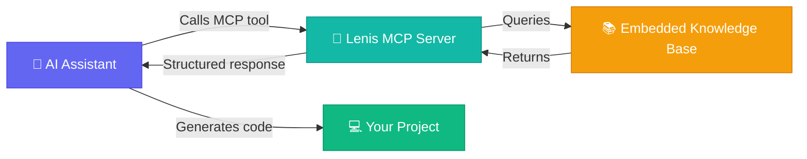

<!-- Lenis MCP Server -->
# 🎯 Lenis MCP Server

<p align="center">
  
  
  
</p>

<p align="center">
  <a href="https://opensource.org/licenses/MIT">
    
  </a>
  <a href="https://modelcontextprotocol.io">
    
  </a>
  <a href="https://lenis.darkroom.engineering/">
    
  </a>
  <a href="https://www.typescriptlang.org/">
    
  </a>
  <a href="https://greensock.com/gsap/">
    
  </a>
</p>

> MCP server that provides **Lenis smooth scroll expertise** to AI assistants. Knowledge-based — no external API calls, all documentation is embedded.

## 📋 About

The **Lenis MCP Server** is a [Model Context Protocol](https://modelcontextprotocol.io) server that gives AI coding assistants deep knowledge about [Lenis](https://lenis.darkroom.engineering/) — the lightweight, performant smooth scroll library by darkroom.engineering.

All documentation (settings, methods, events, patterns, troubleshooting) is **embedded directly** in the server. When an AI assistant calls a tool, it receives structured, accurate information — **no network requests, no API keys, zero latency**.

## 🛠️ Tools

| Tool | Description |
|------|-------------|
| 🔧 `lenis_generate_setup` | Generate setup code for vanilla JS, React, Vue, Next.js (+ GSAP, snap) |
| 📖 `lenis_get_api_reference` | Query settings, methods, events, properties with search |
| 🐛 `lenis_debug_scroll_issue` | Diagnose scroll issues against known limitations |
| 🎨 `lenis_create_scroll_pattern` | Production-ready patterns: parallax, snap, horizontal, WebGL sync |
| ⚡ `lenis_optimize_performance` | Performance recommendations for your setup |

---

## 🏗️ How It Works



---

## 📦 Installation

### Via npx (recommended)

Add to your MCP config (Claude Desktop, Cursor, Windsurf, etc.):

```json
{
  "mcpServers": {
    "lenis-mcp": {
      "command": "npx",
      "args": ["-y", "lenis-mcp-server"]
    }
  }
}
```

### From source

```bash
git clone https://github.com/devAndreotti/lenis-mcp-server.git
cd lenis-mcp-server
npm install
npm run build
```

Then add to your MCP config:

```json
{
  "mcpServers": {
    "lenis-mcp": {
      "command": "node",
      "args": ["path/to/lenis-mcp-server/dist/index.js"]
    }
  }
}
```

---

## 🌟 Features

| Feature | Description |
|---------|-------------|
| 🚀 **Zero Latency** | All docs embedded — no network requests needed |
| 🎯 **Framework-Aware** | Supports vanilla JS, React, Vue, and Next.js |
| 🔗 **GSAP Integration** | Deep knowledge of ScrollTrigger integration |
| 🐛 **Smart Debugging** | Matches symptoms against known limitations |
| 📱 **Mobile-Ready** | Performance tips for touch & mobile optimization |
| 🎨 **Pattern Library** | Parallax, snap, horizontal, WebGL sync, and more |

---

## 💬 Example Prompts

- *"Set up Lenis with GSAP ScrollTrigger in my React app"*
- *"What are all the Lenis settings and their defaults?"*
- *"My scroll is janky on Safari, help me fix it"*
- *"Create a parallax effect with Lenis and GSAP"*
- *"Optimize my Lenis setup for mobile devices"*
- *"How do I handle nested scroll containers?"*

---

## 📂 Project Structure

```shell
lenis-mcp-server/
│
├── src/
│   ├── index.ts              # MCP server with 5 tools
│   └── knowledge/
│       └── lenis-docs.ts     # Complete Lenis knowledge base
│
├── package.json
├── tsconfig.json
├── LICENSE
└── README.md
```

---

## 🐛 Troubleshooting

| Problem | Solution |
|---------|----------|
| Server won't start | Ensure Node.js ≥ 18 and run `npm run build` first |
| Tools not appearing | Check MCP config path is correct and restart your IDE |
| Outdated information | Open an issue or PR to update the knowledge base |

---

## 💪 Contributing

Contributions are welcome! Follow the steps below:

1. Fork this repository.
2. Create a branch: `git checkout -b feature/your-feature`.
3. Commit your changes: `git commit -m "feat: my contribution"`.
4. Push to the branch: `git push origin feature/your-feature`.
5. Open a Pull Request with a summary of proposed changes.

Use [Conventional Commits](https://www.conventionalcommits.org/): `feat:`, `fix:`, `docs:`, `style:`, `refactor:`, `test:`, `chore:`.

## 📝 License

This project is under the **MIT** license. See the [LICENSE](./LICENSE) file for details.

---

<p align="center">
  Built with ☕ by <a href="https://github.com/devAndreotti">devAndreotti</a>
</p>
